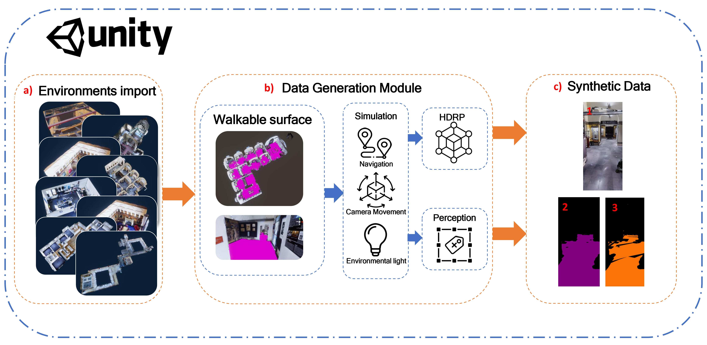

# World-map misalignment detection for visual navigation systems
Code and documentation of the paper World-map misalignment detection for visual navigation systems

We consider the problem of inferring when the internal map of an indoor navigation system is misaligned with respect to the real world (world-map misalignment), which can lead to misleading directions given to the user. We note that world-map misalignment can be predicted from an RGB image of the environment and the floor segmentation mask obtained from the internal map of the navigation system. Since collecting and labelling large amounts of real data is expensive, we developed a tool to simulate human navigation, which is used to generate automatically labelled synthetic data from 3D models of environments. Thanks to this tool, we generate a dataset considering 15 different environments, which is complemented by a small set of videos acquired in a real-world scenario and manually labelled for validation purposes. We hence benchmark an approach based on different ResNet18 configurations and compare their results on both synthetic and real images. We
achieved an F1 score of 92.37% in the synthetic domain and 75.42% on the proposed real dataset using our best approach. While the results are promising, we also note that the proposed problem is challenging, due to the domain shift between synthetic and real data, and the difficulty in acquiring real data. The dataset and the
developed tool are publicly available to encourage research on the topic.

# Data generation tool

The code related to the data generation tool is located in /unity_tool. It includes the project assets and all relevant navigation and randomization scripts. The 3D models of environments (if available) need to be downloaded separately and placed in the /models directory within the Unity project (under the directory "Modelli" place a directory called n-<model name> n is an integer from 0). Inside each model directory, a prefab called MODEL.prefab should be placed.

Please refer to this URL to set-up the unity [Perception Package]([https://www.google.com](https://docs.unity3d.com/Packages/com.unity.perception@1.0/manual/index.html))

# Dataset

The proposed dataset is available 
[here](https://iplab.dmi.unict.it/sharing/misalignment_detection/data.zip).

In the provided zip file are present 2 CSV files that refer to the virtual dataset and the real one.
The CSV referred to synthetic data contains :
- JSON file path of the frame.
- Path to the RGB image file.
- Path of the correct path segmentation file.
- Path of the wrong path segmentation file.
- Path to correct floor segmentation file path.
- File path of the incorrect floor segmentation due to misalignment.
- File path to the correct mask file of the Navigation Mesh provided by the Unity agent.
- File path of the incorrect mask of the Navigation Mesh provided by the Unity agent.
- Navigation start point.
- Navigation goal point.
- Difficulty of misalignment (Hard, Medium or Easy).
- Correct floor segmentation rotation (expressed in quaternions).
- Incorrect floor segmentation rotation (expressed in quaternions).
- Correct floor segmentation position (expressed in a vector (x,y,z)).
- Incorrect floor segmentation position (expressed in a vector (x,y,z)).
- Number of pixels of the correct path segmentation.
- Number of pixels of the correct path segmentation that are on the correct floor segmentation.
- Number of pixels of the incorrect path segmentation.
- Number of pixels of the incorrect path segmentation that lie on the correct floor segmentation.

Synthetic data can be found in the New_acquisition folder.
Real data are split into 3 folders, Aligned_frames, Misaligned_frames and Unknown_frames.

/dataset contains the Statistics_Building file, used to analyze and visualize proposed virtual data.

# Training and Testing

/baseline contains scripts used for training and testing the different models presented in the paper.
